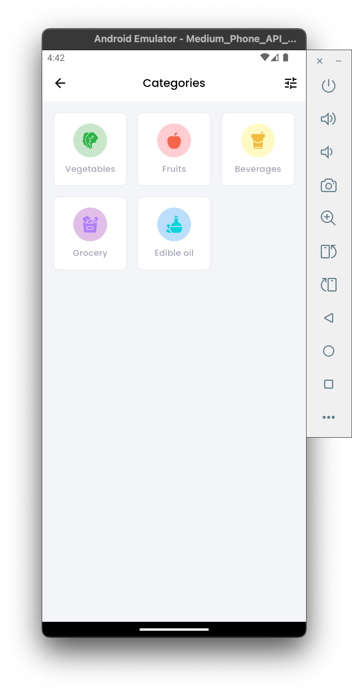

# EcoApp - Grocery Shopping Mobile App

EcoApp adalah aplikasi mobile - **Cart Management**: Swipe gestures dan quantity controls

> **Note**: ✅ Screenshots sudah tersedia di folder `screenshots/` menampilkan 6 halaman utama aplikasi: Home, Categories, Products, Product Detail, Cart, dan Profile.

## 🛠️ Tech Stackmerce untuk belanja groceries dan produk organik yang dibangun menggunakan Flutter. Aplikasi ini menyediakan pengalaman berbelanja yang mudah dan intuitif dengan focus pada produk segar dan organik.

## 🌟 Fitur Utama

- **Splash Screen & Onboarding**: Pengenalan aplikasi untuk pengguna baru
- **Autentikasi**: System login dengan penyimpanan aman menggunakan Flutter Secure Storage
- **Beranda**: Tampilan utama dengan pencarian, carousel banner, kategori produk, dan daftar produk unggulan
- **Kategori Produk**:
  - Sayuran (Vegetables)
  - Buah-buahan (Fruits)
  - Minuman (Beverages)
  - Groceries
  - Minyak Goreng (Edible Oil)
- **Detail Produk**: Informasi lengkap produk dengan rating, deskripsi, dan pemilihan quantity
- **Shopping Cart**: Keranjang belanja dengan fitur tambah/kurang quantity dan swipe to delete
- **Wishlist**: Daftar produk favorit
- **Profile**: Halaman profil pengguna dengan menu navigasi

## � Tampilan UI Aplikasi

### Screenshots

<table>
  <tr>
    <td align="center">
      
      <br>
      <sub><b>Home/Beranda</b></sub>
    </td>
    <td align="center">
      
      <br>
      <sub><b>Categories</b></sub>
    </td>
    <td align="center">
      
      <br>
      <sub><b>Products List</b></sub>
    </td>
  </tr>
  <tr>
    <td align="center">
      
      <br>
      <sub><b>Product Detail</b></sub>
    </td>
    <td align="center">
      
      <br>
      <sub><b>Shopping Cart</b></sub>
    </td>
    <td align="center">
      
      <br>
      <sub><b>User Profile</b></sub>
    </td>
  </tr>
</table>

### UI Features Highlights

- **Modern Design**: Clean dan minimalist interface dengan eco-friendly color scheme
- **Responsive Layout**: Adaptive design untuk berbagai ukuran layar
- **Intuitive Navigation**: Bottom navigation bar dan smooth transitions
- **Visual Hierarchy**: Typography yang jelas dengan Poppins font family
- **Interactive Elements**: Cards, buttons, dan icons yang responsive
- **Product Showcase**: Grid layout untuk product listing dengan wishlist functionality
- **Search Experience**: Real-time search dengan category filtering
- **Cart Management**: Swipe gestures dan quantity controls

> **Note**: Untuk menambahkan screenshots, buat folder `screenshots/` di root project dan tambahkan file gambar sesuai dengan nama yang disebutkan di atas.

## �🛠️ Tech Stack

### Framework & Language

- **Flutter**: 3.3.1+ (Cross-platform mobile development)
- **Dart**: Language utama untuk pengembangan

### State Management

- **Riverpod**: 2.6.1 (State management yang powerful dan type-safe)
- **Riverpod Generator**: 2.6.3 (Code generation untuk Riverpod)

### Arsitektur

- **Clean Architecture**: Pembagian layer Domain, Data, dan Presentation
- **Repository Pattern**: Abstraction untuk data sources
- **Use Cases**: Business logic layer
- **Entity & Models**: Data representation dengan Freezed

### UI/UX

- **Flutter ScreenUtil**: 5.9.3 (Responsive design)
- **Poppins Font**: Custom font family dengan berbagai weight
- **Flutter SVG**: 2.0.17 (SVG asset support)
- **Carousel Slider**: 5.0.0 (Image carousel)
- **Introduction Screen**: 3.1.17 (Onboarding screens)
- **Awesome Bottom Bar**: 1.2.4 (Custom bottom navigation)

### Network & Data

- **Dio**: 5.8.0+1 (HTTP client untuk API calls)
- **Flutter Secure Storage**: 9.2.4 (Secure data storage)
- **Flutter DotEnv**: 5.2.1 (Environment variables)

### Navigation

- **Go Router**: 14.7.2 (Declarative routing)

### Utilities

- **Dartz**: 0.10.1 (Functional programming - Either type)
- **Equatable**: 2.0.7 (Value equality)
- **Intl**: 0.20.2 (Internationalization dan formatting)

### Code Generation

- **Freezed**: 2.5.7 (Data classes dan Union types)
- **JSON Serializable**: 6.9.0 (JSON serialization)
- **Build Runner**: 2.4.13 (Code generation runner)

## 📁 Struktur Proyek

```
lib/
├── app/                    # App configuration
├── core/                   # Core utilities
│   ├── constants/          # App constants (endpoints, strings, etc.)
│   ├── routes/            # Navigation setup
│   └── utils/             # Utilities (Dio client, environment, etc.)
├── data/                   # Data layer
│   ├── datasources/        # Remote & local data sources
│   ├── models/            # Data models with JSON serialization
│   └── repositories/       # Repository implementations
├── domain/                 # Domain layer
│   ├── entities/          # Business entities
│   ├── repositories/       # Repository interfaces
│   └── usecases/          # Business logic
├── presentation/          # Presentation layer
│   ├── providers/         # Riverpod state providers
│   └── screens/           # UI screens dan widgets
└── shared/                # Shared resources (themes, colors, typography)
```

## 🚀 Cara Menjalankan Proyek

### Prerequisites

- Flutter SDK 3.3.1 atau lebih tinggi
- Dart SDK
- Android Studio / VS Code
- Android/iOS Emulator atau device fisik

### Installation

1. **Clone repository**

```bash
git clone [repository-url]
cd ecoapp
```

2. **Install dependencies**

```bash
flutter pub get
```

3. **Setup environment**
   - Buat file `.env` di root project
   - Tambahkan konfigurasi API:

```env
BASE_URL=http://10.0.2.2:8080
```

4. **Generate code**

```bash
flutter packages pub run build_runner build
```

5. **Run aplikasi**

```bash
flutter run
```

## 🎨 Design System

### Color Palette

Aplikasi menggunakan skema warna yang konsisten dengan tema eco-friendly:

- **Primary**: Warna hijau untuk elemen utama
- **Secondary**: Warna background utama
- **Text Colors**: Hierarchy warna text yang jelas
- **System Colors**: Error, warning, dan success states

### Typography

Menggunakan font **Poppins** dengan berbagai weight:

- Thin (100) hingga Black (900)
- Support untuk italic styles
- Responsive text sizing dengan ScreenUtil

### Assets

- **Icons**: SVG icons untuk konsistensi dan scalability
- **Images**: PNG images untuk ilustrasi dan foto produk
- **Fonts**: Complete Poppins font family

## 🔧 Konfigurasi Development

### API Integration

- Base URL dikonfigurasi melalui environment variables
- Dio client dengan interceptor untuk authentication
- Error handling dengan Either type dari Dartz

### State Management

- Riverpod untuk global state management
- Provider pattern untuk dependency injection
- Reactive UI updates

### Responsive Design

- ScreenUtil untuk responsive sizing
- Adaptive layouts untuk berbagai ukuran screen
- Consistent spacing dan typography scaling

## 📱 Platform Support

- ✅ Android
- ✅ iOS
- ✅ Web (experimental)
- ✅ Windows (experimental)
- ✅ macOS (experimental)
- ✅ Linux (experimental)

## 🧪 Testing

```bash
# Run unit tests
flutter test

# Run widget tests
flutter test test/widget_test.dart
```

## 📦 Build untuk Production

### Android

```bash
flutter build apk --release
flutter build appbundle --release
```

### iOS

```bash
flutter build ios --release
```

## 🤝 Kontribusi

1. Fork repository
2. Buat feature branch (`git checkout -b feature/amazing-feature`)
3. Commit changes (`git commit -m 'Add amazing feature'`)
4. Push ke branch (`git push origin feature/amazing-feature`)
5. Buat Pull Request

## � Menambahkan Screenshots

Untuk melengkapi dokumentasi dengan screenshot tampilan UI:

### Cara Mengambil Screenshot:

1. **Jalankan aplikasi** di emulator/simulator
2. **Navigate** ke setiap screen yang ingin di-screenshot
3. **Ambil screenshot** menggunakan salah satu cara berikut:

#### Android Emulator:

```bash
# Menggunakan adb
adb exec-out screencap -p > screenshots/screen_name.png
```

Atau klik icon camera di toolbar emulator

#### iOS Simulator:

```bash
# Menggunakan xcrun
xcrun simctl io booted screenshot screenshots/screen_name.png
```

Atau tekan `Cmd + S` di simulator

#### Flutter Tools:

```bash
# Menggunakan Flutter screenshot
flutter screenshot --type=device
```

4. **Simpan file** di folder `screenshots/` dengan nama yang sesuai:

   - `home_page.png` ✅ (tersedia)
   - `categories_page.png` ✅ (tersedia)
   - `products_page.png` ✅ (tersedia)
   - `product_detail_page.png` ✅ (tersedia)
   - `cart_page.png` ✅ (tersedia)
   - `profile_page.png` ✅ (tersedia)

   **File yang bisa ditambahkan untuk melengkapi dokumentasi:**

   - `splash_screen.png` (opsional)
   - `onboarding.png` (opsional)
   - `login.png` (opsional)
   - `wishlist.png` (opsional)

5. **Commit dan push** perubahan ke repository

> 💡 **Tip**: Gunakan resolusi 375x812 (iPhone 12 Pro) untuk konsistensi tampilan di README.md

## �📄 License

Project ini menggunakan lisensi [MIT License](LICENSE).

## 📞 Contact

Untuk pertanyaan atau feedback, silakan hubungi:

- Email: [your-email@example.com]
- GitHub: [github-username]

---

**EcoApp** - Bringing fresh and organic products to your doorstep 🌱
